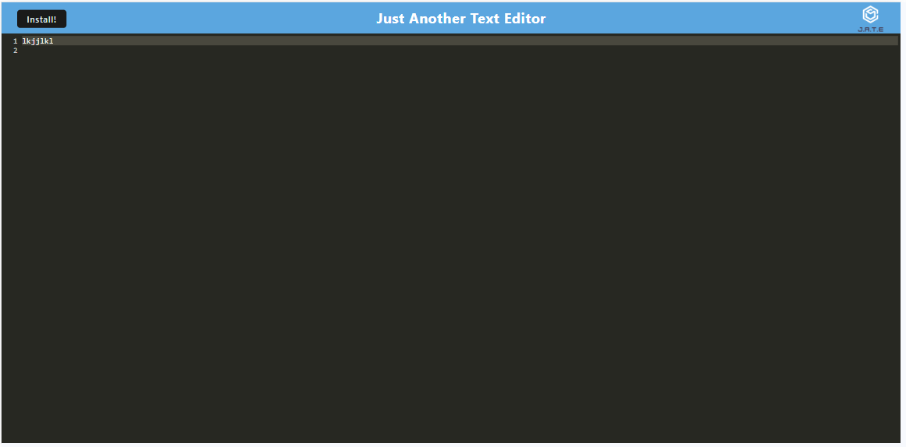
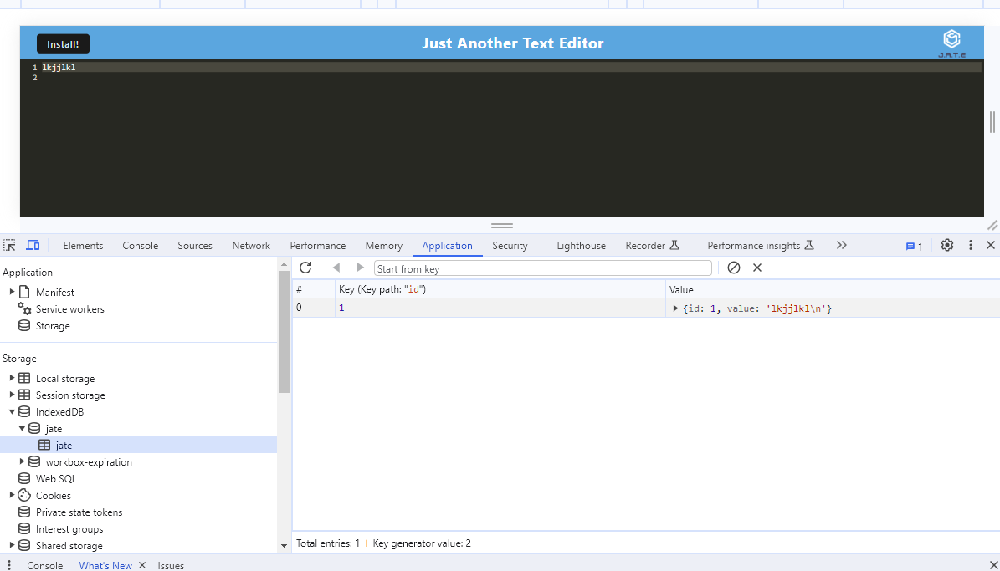
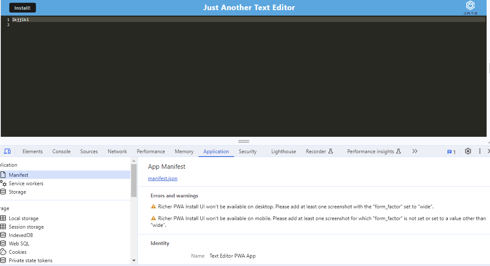

# Text Editor 
## Description
In this app i was tasked with adding code to make it a progressive web application. This include adding webpack, a manifest, and indexedb. This app can be downloaded and run offline.

## Table of Contents
- [Installation](#installation)
- [Links](#links)   
- [Screenshots](#screenshots)   
- [Questions](#questions)
- [License](#license)

## Installation
if you clone this project you can run npm run install to install everything.

## Links
[Repository](https://github.com/KDonnelly33/text-editor)
[Livelink](https://guarded-earth-62670-6a761cccfbb9.herokuapp.com/)

## Screenshots

## Questions
If you have any questions, please contact me at [email](mailto:kevin.donnelly3@gmail.com). You can also visit my [GitHub profile](https://github.com/Kdonnelly33) to view more of my work.

## License
This project uses the MIT license.
For more information, visit https://opensource.org/licenses/MIT.

